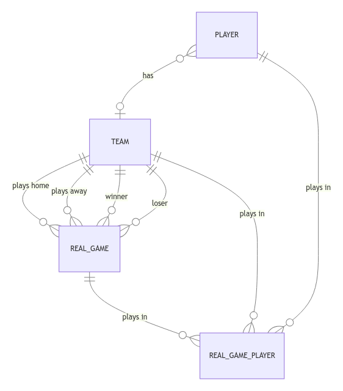

# Technical Exercise

The purpose of this document is to provide candidates with details of the technical exercise, which form part of the interview process at Bamg Sports Ltd.

Below are given details of the exercise and expectations.

Once the exercise has been submitted a code review interview will be conducted with a senior member of the development team to assess the candidate submission against expectations.

## Guidence

The Job Description highlights some of the major packages, languages and tools used by Bamg Sports during their day to day operations.  It is not expected that candidates use them if they are not known to them already, however, it would be most helpful for the candidate to use as many of them as they are familiar with.

However, we strongly suggest the following tools be used: git, typescript, markdown for documentation.

## Expectations

The purpose of the exercise is not a test, but to be a tool with which an informed dialogue can be had with the candidate.  Example points which will be discussed in the review interview may include:

* Comprehension of the exercise and expectations
* Which tooling were chosen and why
* Discussions on planning and features that might be developed
* Use of versioning tools to aid development
* Any patterns that might be used
* Test of and or consideration for testing
* Self documentation

Ergo, it is NOT a expected for canidates to deliver a full finished "product".

## Deliverables

Please deliver a gitlab/github hosted repository containing all files associated with your submission.

Include in that repository a `CANDIDATE_DOCUMENTATION.md` which should contain:
1. Any notes your made preparing for the exercise
1. Instructions for executing the submission
1. Any notes about additional work that could be achieved had you had more time

When complete, email the repository URL to julia.underwood@bamgsports.com.

## Background
In essence this is a simple data management system, where the user can view/edit a table of data, forms to add and edit the data, and the display of related data, along with an accompanying API.

Below a an Entity Relationship Diagram (ERD) of the application ([Mermaid Link](https://mermaid.live/edit#pako:eNqV0cEKgzAMBuBXKTnPF_AmrOyiMNwug4IEjVPQVmpFxPrus3PMMQ9uPTZfSvJ3hFRlBD6QPpZ411gLyeZzDoMbj9mkPE9ZduVBxHwmoMBWwCKed9bO9ZHFPAiTUxBxZ5oKh5YVqqYfKfY47NK-lJL0LqtUu6p3ZUOTZb91hlJumpKPDKxl_3e4Ib-9kHCAmnSNZTanProXBJiCXFoOZ5RjVxlnp5liZ9RlkCn4Rnd0gK7J0NDrq8DPsWppegBp9Iow)) - this is based off of real world data, so it is a little messy.

The definition of this database is given in [create_tables.sql](./sql/create_tables.sql) and the sample data in [fill_tables.sql](./sql/fill_tables.sql).

You do not need to setup this database locally, but if you wish to setup the database in a local docker container, execute the following command in the root of this project, it sets up a populated Postgres instance:

    docker-compose up

You should be able to connect to this database by using the details:

    Hostname: localhost
    Port:     postgres
    Password: postgres

# The Exercise

The exercise is split into two parts, [frontend](#frontend) and [backend](#backend).  You must attempt **at least one**.

## Backend

Provided in the sql folder are `.sql` files describing a database and data.  Use it to create the schema of the database - a [docker-compose.yml](docker-compose.yml) script is provided for your convenience.

The task is to create an API that will interact with this database.  The following is required:

1. Provide an API with endpoints that allows data to be retrieved from the tables
1. Provide an ability to update some of the fields in the tables whilst disallowing changes to other fields
1. Provide an ability to add a new record, and delete a record
1. Ideally the endpoints will provide some nested data to be obtained
1. The resulting program must be executable and be able to interact with via a tool like Postman

1. **BONUS: Only if you have time** normalise the database in a spreadsheet, include a link to it in CANDIDATE_DOCUMENTATION.md

## Frontend

The task is to create a UI that could provide access to the API and data held within.  

Use the `.sql` file in the sql folder to inform yourself of the data you will need to work with.  If you want, use the [docker-compose.yml](docker-compose.yml) script to establish a locally populated database instance.

The following are required:

1. Provide a set of UIs which could display the data to be retrieved from the API

    NOTE: You may mock the backend responses if you do not implement a backend.  **Important** Include any mock data in your git history

1. Provide an ability to display any nested data / repeating data which may be returned from the API
1. Provide forms that permit the update of some data, but also prevent the update of other data
1. Provide an ability to add a new record, and delete a record
1. Ideally the UI should display nested data
1. The resulting program must be executable and be able to interact with any browser
1. **BONUS: Only if you have time** implement a client-side caching strategy

## Finally
If you have any questions of issues with the task, please let us know on the email address above and we'll reply ASAP.

We're looking forward to discussing your exercise submission!